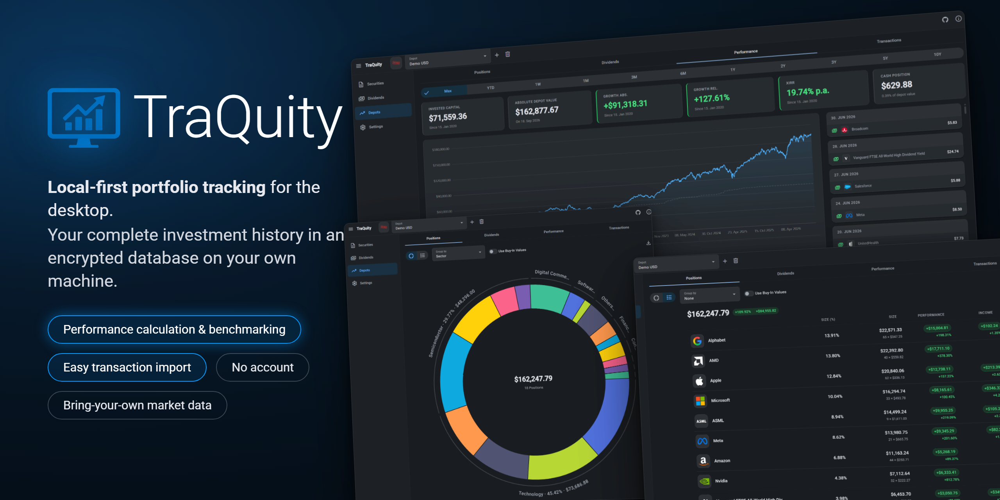

# TraQuity



Local-first portfolio tracking for the desktop. TraQuity keeps your complete investment
history — depots, transactions, dividends, performance — in an AES-encrypted database on your
own machine. No account, no cloud, no telemetry.

## Features

- **Depots & transactions** — track any number of depots; record buys, sells, dividends,
  special dividends, and taxes manually or through a CSV import wizard.
- **Performance analysis** — depot value over time, invested capital, XIRR (annualized
  money-weighted return), and configurable benchmarks: "what if I had put the same money into
  another financial instrument instead?"
- **Positions** — per-holding returns, drill-down into individual purchase lots, allocation
  chart; list and chart can be grouped by security's sector.
- **Dividends** — per-depot dividend history and yield tables, plus a calendar of upcoming
  dividend announcements with in-app notifications.
- **Securities** — master data, stock splits, and historical price charts for every security
  you track.
- **Bring-your-own market data** — historical prices and dividend announcements are pulled from
  HTTP/JSON APIs you configure declaratively (URL, JSON paths, date formats, market closing
  times). The app comes with preconfigured historical price sources — just add your own API
  key. Exchange rates come from the official ECB reference rates, so multi-currency depots are
  converted with daily precision.
- **Privacy by design** — password-protected, AES-encrypted local database; a "hide absolute
  values" mode for sharing your screen without sharing your net worth. No account, no cloud, no
  telemetry — and the app itself lists every server it contacts, in the About dialog's
  `Transparency` tab.

<p>
  
  
</p>
<p>
  
  
</p>

## Getting started

Users: see the [user manual](./USER_MANUAL.md) for database setup, the startup screens, and a feature walkthrough.

Download TraQuity from the [GitHub Releases page](https://github.com/aslopek/traquity/releases). Each release carries one archive per
platform. Every archive holds the complete application directory. There is no installer: unpack it wherever you want the app to live and
start it from there.

The builds are **not code-signed**, so Windows and macOS both flag them on first launch. Getting past that warning means accepting that you
trust this app; the steps below are the same steps that let any unsigned app run, so apply them only to a download you actually wanted.

### Windows

SmartScreen shows *"Windows protected your PC"* when `TraQuity.exe` is started for the first time. Choose **More info → Run anyway**.

### macOS

macOS quarantines anything downloaded by a browser, and since the app is neither signed nor notarized, Gatekeeper refuses to open it and
may report it as *"damaged"*. Clear the quarantine attribute once, from a terminal:

```shell
xattr -cr <path-to-TraQuity.app>
```

Depending on where the app was unpacked this may need `sudo`. Afterwards TraQuity starts normally, and no further launch needs admin rights.

Downloading the release from a terminal avoids the quarantine attribute in the first place, because `curl` does not set it — no `xattr` run
is then necessary:

```shell
mkdir -p ~/Downloads/TraQuity && cd ~/Downloads/TraQuity
curl -fsSL https://api.github.com/repos/aslopek/traquity/releases/latest \
  | grep -o 'https://[^"]*macos-arm64\.zip' \
  | xargs curl -fL -o traquity-macos-arm64.zip
ditto -x -k traquity-macos-arm64.zip .
```

**Where to put the app:** `/Applications` is a poor choice. If you let TraQuity download a Java runtime for you, that runtime is installed
next to the `.app` bundle into `/Applications`. Recommendation: Choose a path in your home directory, e.g. `~/Applications/TraQuity`.
Keep it out of `~/traquity/`, which is where the app keeps its configuration file and its log.

### Linux

Unpack the `.tar.gz` and run the `traquity` binary inside it. There is no signature warning to get past here.

What some distributions do require is one adjustment to the unpacked directory. Electron sandboxes its renderer through unprivileged
user namespaces where the kernel permits them, and falls back to the bundled `chrome-sandbox` helper where it does not — Ubuntu 24.04
and its derivatives restrict those namespaces by default. That helper has to be owned by `root`, which unpacking as a normal user
cannot arrange, so the app aborts on start with *"The SUID sandbox helper binary was found, but is not configured correctly"*. Hand it
over once, inside the unpacked directory:

```shell
sudo chown root:root chrome-sandbox
sudo chmod 4755 chrome-sandbox
```

Starting the app with `--no-sandbox` makes the same message go away, but it does so by dropping the renderer sandbox that isolates
the files you import into TraQuity. The two commands above keep that sandbox intact, which is why they are the recommended route.

### Build from source

Prerequisites: Java 25, Maven 3.9+, Node.js 24.

```shell
git clone https://github.com/aslopek/traquity.git
cd traquity/traquity-server-spring
mvn clean package
cd ../traquity-client-angular
npm ci
npm run build
npm run electron:pack
```

For development, run the backend directly (`mvn spring-boot:run -Dspring-boot.run.profiles=dev`)
and the frontend via `npm run serve` on `http://localhost:4200`. API changes start in
`traquity-api`; both sides regenerate their clients/delegates from the specs
(`npm run generate` / `mvn generate-sources`). See `LLM.md` for the full development workflow.

## Architecture Decision Records

ADRs can be found in [ADR](./architecture/adr.md).

## How it's built

An OpenAPI-first monorepo with three parts:

| Part                      | Role                                                                                 |
|---------------------------|--------------------------------------------------------------------------------------|
| `traquity-api`            | OpenAPI 3 specs — the single source of truth for every HTTP API, one spec per domain |
| `traquity-client-angular` | Angular + NgRx frontend, packaged as the Electron desktop app                        |
| `traquity-server-spring`  | Spring Boot (Java 25) backend, bundled into the desktop app as `backend.jar`         |

At runtime, the Electron main process spawns the Spring Boot backend as a local child process
(`127.0.0.1:23726`) and points the Angular UI at it. Data lives in a single encrypted H2 file
database, schema-managed by Liquibase. Its web console listens on `127.0.0.1:29232`.

These port numbers are not arbitrary: `23726` and `29232` are the birthdays of my grandparents — July 23, 1926 and February 29, 1932 — and
the ports are named in their honor.

### The domain is the unit, not the layer

One idea carries through the whole stack: `traquity-api` splits the HTTP surface into one
OpenAPI spec per domain (`depot`, `depot-transaction`, `security`,
`historical-security-price`, ...), and that split propagates straight down. The backend mirrors
it as one package per domain — each a self-contained vertical slice of controller → service →
repository → entity with its own MapStruct mapper — and the frontend mirrors it again with one
NgRx store slice and one feature folder per domain. Domains don't share internals; only clearly
defined interfaces cross the boundary.

Holding that seam open costs some repeated mapping and plumbing code across domains. That's
deliberate: any domain can be read, understood, and changed end to end without detouring
through shared base classes that couple it to everything else. And because both the Angular
client and the Spring server generate their API layer from the very same specs, the boundary
is enforced structurally, not by convention — frontend and backend cannot drift out of sync
on request/response shapes.

### Testing

Backend testing centers on integration tests: every API endpoint has its own test class (e.g.
`CreateTransactionTest`, `GetDepotPerformanceTest`) driving the real Spring context through
MockMvc — real controllers, services, and H2 database, with outbound third-party calls (e.g.
ECB exchange rates) stubbed at the edge. Every endpoint is verified against actual persistence
and real payloads, not mocks standing in for the components that matter.

The frontend is tested with Jest, in two suites that run independently of each other. The Angular
suite covers the logic layer: reducers, selectors and effects of the global NgRx store, the
computeds, methods and effects of the per-screen Signal Stores, and the pipes that turn derived
state into rendered artifacts. Effects — and anything else that resolves purely through rxjs — are
tested with marbles (`TestScheduler`), so that a `switchMap` dropping an in-flight request is
asserted rather than assumed; timing and cancellation are invisible to a test that just awaits a
value.

The Electron main-process suite covers the desktop shell: the config file and its scrypt auth
records, the startup mode, the backend spawn including the password handover, the Java resolution
chain, the JDK download's signature verification, and the IPC boundary. The `electron/` directory
is laid out for exactly that — everything with logic lives in a module that takes its I/O
dependencies (file system, `fetch`, timers, the spawned child) as arguments, and `main.js` is
wiring only. There is no integration-test harness for Electron main code, and a piece of logic
that can only be reached by booting Electron is a piece of logic nothing will ever test.

What neither suite covers is deliberate on one count and a real limit on the other. Components and
templates have no specs, because logic is kept out of them by design: it belongs in stores and
pipes, which is where the tests are. But nothing here exercises the *packaged* app — wiring,
resource paths, dependency pruning and the Electron fuses are verifiable only on a real packaged
run, so a green suite is never on its own evidence that the shipped app starts.

## Security model

TraQuity is a **single-user local desktop application**, and its security model is built on that
assumption: everything runs on one machine, for one person, and nothing is exposed to a network.
What follows is the summary — the reasoning behind the individual decisions lives in the
[security ADRs](./architecture/security.md) and in the `LLM.md` files, above all
`traquity-client-angular/electron/LLM.md`.

**The database.** One AES-encrypted H2 file at a path you choose, with a password fixed when the
file is created. There is no recovery and no backdoor: lose the password and the data in that file
is gone. The password itself is never stored. What `~/traquity/traquity.config.json` keeps is an
scrypt salt and hash per database, and only so that the unlock screen can tell you that what you
typed differs from what worked last time, before the file is ever asked to open. That record is
written only once a backend start has actually succeeded with that password — the file remains the
sole authority on what its password is — and the config file is written with mode `0600`. A
database you choose to leave unprotected is recorded as an explicit `passwordless` marker rather
than as an empty password.

**The password handover.** The password reaches the backend as the first line of the spawned
process's standard input, with the buffer zeroed once written. The stream then stays open for the
run; closing it asks the backend to shut down. The child's environment carries a marker telling
it to read the password from `stdin`, and no password at all. A process's environment block is
readable from outside it on common systems, a pipe between parent and child is not.

**The backend.** It binds to `127.0.0.1` only, so the port is never on a network, and CORS is
restricted to two origins: the literal `null` Chromium sends for the packaged app's `file://`
document, and the local dev server. There is no authentication layer — no login, no session, no
cookie — because the process boundary is what the access control rests on. CSRF protection is
deliberately disabled: with no ambient credential to forge a request with, a token would add nothing
the origin allowlist does not already provide, and [ADR-001](./architecture/security.md) argues that
case in full, including what would have to change to revisit it.

**The desktop shell.** The renderer runs sandboxed, with context isolation on and Node integration
off, and its only door to the main process is a preload bridge of named IPC channels. Each of those
channels first checks that the event came from the main frame of the app's own window, then
validates its payload against a zod schema with explicit length bounds — the renderer is not the
trustworthy source it looks like, since it renders what a database and third-party HTTP responses
contain. The window refuses to navigate away from its own document (a window that navigates takes
the bridge along to wherever it lands), refuses webviews, answers every permission request and
check with `false` — camera, microphone, location, notifications, and device access via
WebHID/WebUSB/Web Serial — and hands a URL to the operating system only when it is `http:` or
`https:`. The document ships a restrictive CSP; DevTools and spellchecking are off. In the packaged
binary, the Electron fuses `RunAsNode`, `EnableNodeOptionsEnvironmentVariable` and
`EnableNodeCliInspectArguments` are disabled and `OnlyLoadAppFromAsar` is enabled: each of those is
a way to make the shipped executable run something other than this app, before `main.js` is ever
consulted, and they are closed in the binary rather than in code they would bypass anyway.

**Spawning Java.** The JVM is the one binary this app runs that it did not ship, and its path comes
from a config file or a file dialog, so it is treated as untrusted input. A candidate is only ever
an absolute path named `java`/`java.exe`, run without a shell, with an argument vector, a timeout,
a byte budget across its output streams, and an environment stripped of everything that would turn
into an argument of that JVM or of its dynamic linker (`JAVA_TOOL_OPTIONS`, `JDK_JAVA_OPTIONS`,
`_JAVA_OPTIONS`, `LD_PRELOAD`, `LD_AUDIT`, `DYLD_INSERT_LIBRARIES`). If you let the app download a
JDK for you, its detached OpenPGP signature is verified against the Amazon Corretto release signing
key pinned in the source before anything is extracted.

**Refusing to start.** `NODE_TLS_REJECT_UNAUTHORIZED` set to any value other than `1` turns off
certificate verification for the whole process. The app treats that as a state it cannot work in
rather than as a setting: it starts into a dead end that explains the variable, spawns no JVM, and
registers two IPC channels — read the startup state, and quit.

**What the app sends out.** Five recipients, and the app names all of them itself, in the About
dialog's `Transparency` tab:
GitHub for the update check (once per start), the ECB for exchange rates (once per backend start),
whichever market data provider you configured (once per backend start, carrying the security
identifier and your API key), Amazon Corretto if you ask for a JDK download, and Hugging Face if
you ask for an AI model download. There is no telemetry, no
analytics and no crash reporting, and nothing about your portfolio leaves the machine other than
the security identifier a data source you configured is asked about. That notice is a claim about
the code, so adding a request to a new recipient means updating it in the same change — see the
root `LLM.md`.

Every one of these trade-offs is made for a process that lives and dies with one desktop app on one
machine, which is also what makes `traquity-server-spring` **not suitable to deploy as a hosted
service as-is**. That would require, at minimum: authentication/
authorization, per-tenant data isolation instead of one embedded H2 file, TLS, a real CORS/
network exposure policy, disabling the H2 console or entirely switching the database, proper
secrets management, rate limiting, audit logging, and compliance with the terms of the
third-party data sources being queried. Until then, treat the backend strictly as a local
companion process of the desktop app.

## Code Ownership and Use of AI

I started this project in 2023, combining my passion for software engineering and the stock market with the goal of mastering Angular. Since
then, this project has come a long way. In recent months, I have integrated AI tools into my workflow to make decisions faster and implement
with less friction - especially while preparing the codebase for its public release.

However, despite leveraging AI, every architectural decision and every single line of code in this project remains my sole responsibility. I
take full ownership of the project. I use AI as a collaborative partner to:

- Translate ideas into concrete architectural requirements
- Derive implementation plans
- Support with complex refactorings, code reviews or drafting an implementation

No AI-generated output - whether it's an acceptance criterion, an architectural decision or a line of code - is committed into this
repository without personal review. New features are the result of an ongoing "discussion" with the AI; sometimes its arguments win me over,
and sometimes mine prevail.

For more information on how AI is leveraged in this repository, view the `LLM.md` files in this repository.

## Changelog

See [CHANGELOG.md](./CHANGELOG.md) for notable changes.

## Contributing

Feature requests and bug reports are welcome as GitHub issues; pull requests are not accepted — see [CONTRIBUTING.md](./CONTRIBUTING.md).

Please refer to [SECURITY.md](./SECURITY.md) for guidance on how to report vulnerabilities.

## License

MIT — see [LICENSE](./LICENSE). The "TraQuity" name and logo files are excluded from the license;
see the exception note in the LICENSE file. Third-party attributions are shown in the app's
About dialog.
