# TraQuity User Manual

TraQuity is a local-first desktop application for tracking investment portfolios. It records depots, transactions, dividends and
securities in a single encrypted database file on your own machine. There is no account and no cloud storage. The only outgoing network
traffic is the market data you configure yourself, the European Central Bank exchange rates, an update check against GitHub, and — if you
ask for them — a Java runtime download and an AI model download.

This manual is written to be read both by people and by language models answering questions about TraQuity. Every section states facts in
short sentences, names buttons and screens exactly as the app labels them, and avoids relying on context from other sections.

## Contents

- [Quick reference](#quick-reference)
- [Installation](#installation)
- [What happens when the app starts](#what-happens-when-the-app-starts)
- [Privacy: what leaves your computer](#privacy-what-leaves-your-computer)
- [The configuration screen](#the-configuration-screen)
- [The unlock screen](#the-unlock-screen)
- [Your database](#your-database)
- [The configuration file](#the-configuration-file)
- [The Java runtime](#the-java-runtime)
- [Quick start: from an empty database to first numbers](#quick-start-from-an-empty-database-to-first-numbers)
- [Working with depots](#working-with-depots)
- [Recording transactions](#recording-transactions)
- [Managing securities](#managing-securities)
- [Market data sources](#market-data-sources)
- [AI features](#ai-features)
- [A tour of the screens](#a-tour-of-the-screens)
- [Understanding your depot performance numbers](#understanding-your-depot-performance-numbers)
- [Dev mode and direct database access](#dev-mode-and-direct-database-access)
- [Troubleshooting](#troubleshooting)

## Quick reference

| Item                    | Value                                                                                                                     |
|-------------------------|---------------------------------------------------------------------------------------------------------------------------|
| Database file           | One AES-encrypted [H2](https://h2database.com) file, `<name>.mv.db`, at a path you choose                                 |
| Database password       | Chosen when the database is created; there is **no recovery**                                                             |
| Configuration file      | `traquity.config.json` in a `traquity` folder in your home directory, e.g. `C:\Users\<you>\traquity\traquity.config.json` |
| Log file                | `traquity.log` next to it, deleted and rewritten on every start                                                           |
| Downloaded Java runtime | `java/` in the app's working directory (only if you choose the download)                                                  |
| Downloaded AI model     | A folder you pick per download (only if you choose to download one)                                                       |
| AI prompt overrides     | `ai/prompts/` in the same `traquity` folder (only if you create them)                                                     |
| Backend port            | `127.0.0.1:23726`                                                                                                         |
| H2 console port         | `127.0.0.1:29232` (reachable through the app's dev mode)                                                                  |
| Required runtime        | Java 25 (any distribution) — configured, found on the `PATH`, or downloaded by the app                                    |
| Supported platforms     | Windows x64, macOS Apple Silicon, Linux x64                                                                               |

## Installation

Download the archive for your platform from the [GitHub Releases page](https://github.com/aslopek/traquity/releases) and unpack it. The
archive contains the complete application directory; there is no installer to run.

The builds are not code-signed, so Windows and macOS both warn about them on first launch. The
[Getting started](./README.md#getting-started) section of the README explains what each warning looks like, how to get past it, and where
to put the app on macOS.

TraQuity needs a Java 25 runtime to run its backend. You do not have to install one beforehand: if none is found, the app opens its
configuration screen, where you can point it at an existing runtime or download one. See [The Java runtime](#the-java-runtime).

## What happens when the app starts

The window opens immediately and then shows one of four screens. Which one it is depends on the checks below, evaluated in this order:

| # | Condition                                                                        | Screen shown         |
|---|----------------------------------------------------------------------------------|----------------------|
| 1 | `NODE_TLS_REJECT_UNAUTHORIZED` is set to anything other than `1`                 | TLS warning screen   |
| 2 | `traquity.config.json` is missing or cannot be read                              | Configuration        |
| 3 | The previous session asked for the configuration screen (Settings action)        | Configuration        |
| 4 | The configuration file names no database                                         | Configuration        |
| 5 | No usable Java runtime could be resolved                                         | Configuration        |
| 6 | The selected database is recorded as having no password                          | Splash, then the app |
| 7 | Anything else (a remembered password, or a database the app knows nothing about) | Unlock               |

The backend is started only after that screen is done with — from the unlock screen, from the configuration screen, or immediately in
case 6. While the backend boots, the splash screen is shown. Once the backend answers, the normal app appears.

The TLS warning screen (case 1) is a refusal, not a prompt. TraQuity downloads files over HTTPS and relies on certificate verification, so
with verification disabled it starts nothing at all: no backend, no database access. Unset `NODE_TLS_REJECT_UNAUTHORIZED` or set it to `1`,
then start the app again.

## Privacy: what leaves your computer

TraQuity keeps everything in one encrypted database file on your computer. There is no account, no cloud sync, no telemetry, no analytics
and no crash reporting, and no font or icon is fetched at runtime. The full, current text is in the app: open the About dialog (the `ⓘ`
button, in the header and in the top right corner of the unlock and configuration screens) and select the `Transparency` tab.

What the app sends, and when:

| Recipient                             | When                                           | What it carries                               |
|---------------------------------------|------------------------------------------------|-----------------------------------------------|
| GitHub (`api.github.com`)             | automatically, once each time the app opens    | nothing of yours; asks for the latest release |
| European Central Bank                 | automatically, on every backend start          | nothing of yours; the daily rates file        |
| the market data sources you configure | on every backend start, and on a manual update | the symbol/ISIN and the API key in your URL   |
| Amazon Corretto (`corretto.aws`)      | only when you start the Java download          | nothing of yours                              |
| Hugging Face (`huggingface.co`)       | only when you start an AI model download       | nothing of yours; the model file              |

Links you click — the GitHub button, the package links in the About dialog, the Corretto FAQ link — open in your default browser, which
makes those requests instead of the app.

The market data row is the only one that says anything about your portfolio, and it is the one you control: no request is made until you
enter an API key and assign a source to a security, and deleting or deactivating a source stops it. The provider's own terms and privacy
policy apply to what it does with what it receives.

Hugging Face is only contacted for downloading GGUF files. The AI features themselves run on your computer. See [AI features](#ai-features).

## The configuration screen

The configuration screen is where the database and the Java runtime are chosen. It is one screen with two sections and two finish buttons.
Nothing is written until a finish button is pressed, except where noted below.

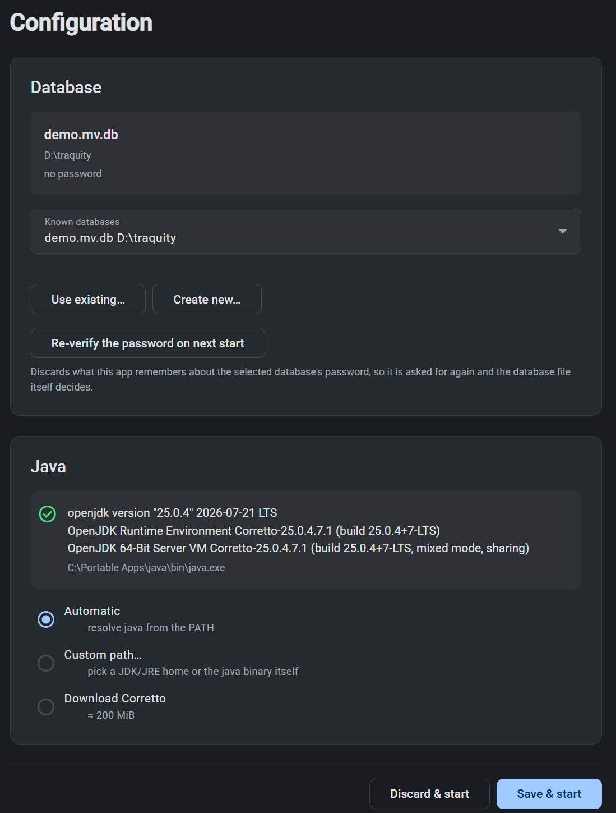

You reach it in five ways: on a first run, after an unreadable configuration file, when the configuration names no database, when Java
cannot be resolved, and through **Settings → Database → Restart & configure database…**.

### Notices at the top

- **`traquity.config.json` could not be read** — the file is invalid JSON or violates the expected structure. It is left on disk exactly as
  it is, so you can still repair it by hand. The screen names the log file that records the reason.
- **`<file>` could not be opened** — the previous backend start failed for that database file. The screen names the file, its directory and
  the log file.

### Database section

The section header shows the currently selected database: its file name, its directory, and one of these states:

| State shown                                      | Meaning                                                                      |
|--------------------------------------------------|------------------------------------------------------------------------------|
| `new file, created on first start`               | You chose **Create new…**; the file is created when the backend first starts |
| `password remembered`                            | The app has a stored hash for this file and verifies your input against it   |
| `no password`                                    | The app recorded this file as unprotected and never asks for a password      |
| `existing file · its password is asked on start` | The app knows nothing about this file's password yet                         |

Controls:

- **Known databases** — a dropdown of every database the app has a recorded password state for. Selecting one switches to it.
- **Use existing…** — a native file dialog for picking an existing `.mv.db` file.
- **Create new…** — a native save dialog for naming a new database file. Choosing this reveals a **Password** and a **Confirm password**
  field, plus a visibility toggle.
  - The two fields must match, otherwise the screen shows *The confirmation does not match the password.* and refuses to finish.
  - Leaving both empty is allowed and warns *Leave both empty and this database will be accessible without a password.*
  - The password is applied when the file is created, on the next backend start.
- **Re-verify the password on next start** — discards what the app remembers about the selected database's password, so it is asked for
  again and the database file itself decides. This is the one control that writes immediately, and it is not undone by **Discard & start**.
  Use it after changing the file's password outside the app, for example with H2's own tools.

### Java section

The Java section is described in [The Java runtime](#the-java-runtime).

### Finishing

- **Save & start** — writes the changes of both sections in a single write to `traquity.config.json`, then continues the startup. It is
  enabled only when the database selection and the Java selection are both valid.
- **Discard & start** — writes nothing and continues with the configuration as it was. It is disabled on a true first run, because there is
  no previous configuration to continue with. Closing the window quits the app.

What follows the finish depends on the selected database:

- A database you just created with a password: the backend starts with that password.
- A database recorded as having no password: the backend starts without one.
- Anything else: the unlock screen, because only the database file can prove its password.

## The unlock screen

The unlock screen asks for the password of the selected database. It shows the file name and the full path of the file it is asking about.

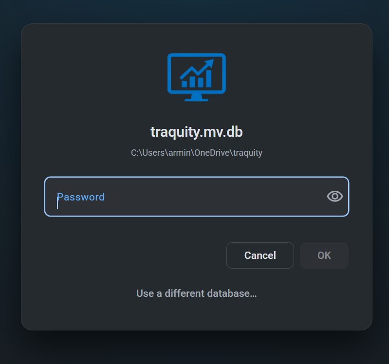

- **Password** — the input, with an eye icon that toggles visibility.
- **OK** — starts the backend with the typed password. For a database whose password the app has remembered, `OK` stays disabled until the
  input matches the stored hash; that comparison happens locally and never touches the database file. For a database the app knows nothing
  about, `OK` is enabled right away and the database file itself decides.
- **Cancel** — quits the app.
- **Use a different database…** — opens the [configuration screen](#the-configuration-screen).
- **ⓘ**, in the top right corner — opens the About dialog, including the
  [transparency note](#privacy-what-leaves-your-computer). The configuration screen carries the same button. The third-party licenses of the
  backend are missing there, because at that point no backend is running yet.
- Pressing `Enter` in the password field is the same as pressing `OK`.

If the backend fails to start, the screen shows *wrong password or corrupted database* and you can try again. If the app had remembered a
password and the start still failed, you land on the configuration screen instead: something about the file changed, and the stored hash is
no longer the right thing to compare against.

## Your database

Everything you enter is stored in a single AES-encrypted H2 database file. You pick the location and the name in the configuration screen.
The `.mv.db` extension is added by the database engine; TraQuity refers to the file by its path *without* that extension internally.

### The password

- The password is fixed when the database file is created. It encrypts the file itself.
- **There is no recovery.** If you lose the password, the data in the file is gone. No support, no reset, no backdoor.
- An empty password is a valid choice and means the file is unprotected: anyone with access to the file can open it.
- The password is never stored anywhere in plain text. What the app stores is an scrypt salt and hash in
  `traquity.config.json`, and only to answer "is this the password you typed last time" without touching the file. A database with no
  password is stored as an explicit `passwordless` marker instead.
- That record is written only after a backend start has actually succeeded with that password, because only then is it proven the password
  decrypts the file. A failed start never deletes a record.
- The password reaches the backend over the backend process's standard input, which is closed immediately afterwards. It is deliberately
  not passed as an environment variable, since environment blocks are readable by other processes of the same user for the lifetime of the
  process.

### Third-party access while the app runs

While TraQuity runs, its backend listens on `127.0.0.1:23726` without authentication. Other software running on your machine can therefore
read and change your data through that HTTP API. This is what makes third-party add-ons on top of TraQuity possible, and it also means the
data is fully protected only while no TraQuity instance has the database open.

### Moving the database

**Before you start:** TraQuity does not report a missing database file as an error. If it is started against a path where no file exists, a
new, empty database is created there. So change the path *before* letting the app start against the old one.

1. Quit TraQuity.
2. Move the `.mv.db` file to its new location. Renaming it is fine; keep the `.mv.db` extension.
3. Either edit `env.TQ_DB_FILE_PATH` in `traquity.config.json` to the new path **without** the `.mv.db` extension and start the app, or
   start the app and, on the unlock screen, choose **Use a different database…** without entering a password.
4. If you took the second route: in the configuration screen, press **Use existing…**, pick the file at its new location, and press
   **Save & start**.

The `auth` entry of the old path stays behind and can be deleted from the configuration file. The new path is asked for its password once
and remembered afterwards.

If you did start the app against the old path and now look at an empty portfolio: quit, delete the newly created empty `.mv.db` file at the
old path, and repeat the steps above. Your data is untouched in the file you moved.

### Using several databases

You can keep any number of databases, for example a real portfolio and a playground. Switch between them in the configuration screen: the
**Known databases** dropdown lists the ones the app has a password record for, and **Use existing…** reaches any other file. **Create new…**
starts an empty one, encrypted with the password you define there.

To switch databases while the app is running, use **Settings → Database → Restart & configure database…**. The app restarts
into the configuration screen.

### Backups

Quit the app and copy the `.mv.db` file somewhere safe. That single file is your complete portfolio. Restoring means copying it back, or
pointing TraQuity at the copy via **Use existing…**.

### Changing the password (advanced)

There is no built-in way to change the password of an existing database. Use H2's `ChangeFileEncryption` tool with an H2 jar matching the
bundled version (currently 2.4.x), **after making a backup**:

```shell
java -cp h2-2.4.240.jar org.h2.tools.ChangeFileEncryption -dir <folder> -db <name> -cipher \
AES -decrypt <oldPassword> -encrypt <newPassword>
```

Switching from "no password" to "password" (or the other way round) is the same operation with one side left empty.

Afterwards, start TraQuity, open the configuration screen and press **Re-verify the password on next start** for that database. Otherwise
the app still compares your input against the hash of the old password.

## The configuration file

Startup settings live in `traquity.config.json`, in a `traquity` folder in your home directory (e.g. `C:\Users\<you>\traquity\` on
Windows). TraQuity writes it with owner-only permissions. It is read once at start; edits made while the app runs are overwritten by the
next write. `traquity.log` (see [Troubleshooting](#troubleshooting)) lives in the same folder.

```json
{
  "env": {
    "TQ_DB_FILE_PATH": "C:\\Users\\you\\traquity\\traquity"
  },
  "auth": {
    "C:\\Users\\you\\traquity\\traquity": {
      "scrypt": {
        "salt": "<base64>",
        "hash": "<base64>",
        "cost": 16384,
        "blockSize": 8,
        "parallelization": 1
      }
    },
    "D:\\backup\\traquity-test": {
      "passwordless": true
    }
  },
  "java": {
    "path": null,
    "signature": null
  },
  "ai": {
    "confirmedNotice": "<base64>",
    "models": {
      "qwen-4b": {
        "path": "D:\\models\\Qwen_Qwen3.5-4B-Q4_K_M.gguf",
        "active": true
      }
    }
  }
}
```

| Key                    | Meaning                                                                                                 |
|------------------------|---------------------------------------------------------------------------------------------------------|
| `env`                  | Environment variables handed to the backend process                                                     |
| `env.TQ_DB_FILE_PATH`  | The database file path **without** the `.mv.db` extension — this is the database the app starts against |
| `auth`                 | One entry per database path: either an `scrypt` record or `{"passwordless": true}`                      |
| `java.path`            | Absolute path of a `java` binary to use, or `null` to resolve `java` from the `PATH`                    |
| `java.signature`       | Set by the app for a runtime it downloaded itself; `null` for a picked or automatically resolved one    |
| `configureOnNextStart` | Written by the Settings action, consumed and removed at the next start                                  |
| `ai.confirmedNotice`   | Records that you confirmed the AI notice                                                                |
| `ai.models`            | One entry per downloaded model: where its file is, and whether it is the active one                     |

Notes:

- On Windows, write paths with escaped backslashes (`C:\\data\\traquity`) or with forward slashes (`C:/data/traquity`).
- A database with no `auth` entry is treated as "password state unknown": the unlock screen asks, and the entry is written once a start
  succeeds.
- A single malformed `auth` entry only makes *that* database ask again. It does not invalidate the rest of the file.
- The same holds for `ai.models`: each entry is checked on its own, and one whose file is no longer on disk reads as "not downloaded".
- Setting `TQ_DB_FILE_PASSWORD` in the `env` block has no effect. That variable, along with a handful of JVM and dynamic-linker variables,
  is stripped from the environment of every Java process the app spawns.
- If the file cannot be read at all, it is left untouched and the app starts into the configuration screen. The reason is written to
  `traquity.log`.

## The Java runtime

TraQuity's backend is a Java program. The app resolves a runtime in this order at every start:

1. `java.path` from the configuration file, if it points at a runnable `java` binary.
2. `java` from the `PATH`.
3. Neither works: the app opens the configuration screen with the Java section carrying the error.

A `java.path` that stopped working — an in-place JDK upgrade, a moved directory — therefore does not stop the app as long as the `PATH`
provides a working runtime. The configuration screen still reports it as an error, because it verifies the literal setting rather than the
fallback.

The **Java** section of the configuration screen shows the verification result at the top: on success the `java -version` output and the
path of the binary, on failure the error. Below it are three options:

- **Automatic** — resolve `java` from the `PATH`.
- **Custom path…** — opens a native dialog to pick a JDK/JRE home directory or the `java` binary itself. The pick is verified by actually
  running it, and a runtime that does not run is reported instead of being saved.
- **Download Corretto** — downloads Amazon Corretto, roughly 200 MiB. A note about its license (GNU GPL v2 with the Classpath Exception)
  appears first, with **Download** and **Cancel**; the download then reports progress, speed and remaining time.

About the download:

- Available for Windows x64, macOS Apple Silicon and Linux x64.
- The archive's signature is verified against Amazon's release signing key before anything is extracted. A failed verification is a failed
  download, and whatever runtime was there before is left untouched.
- It is installed into a `java` directory in the app's working directory. On macOS that is the directory holding the `.app` bundle; on
  Windows and Linux it is the directory the app was started from, which is the app's own directory when it is launched from a file manager.
  Keeping the runtime next to the app means deleting the app also removes the runtime it downloaded. This forces most users when updating
  the app to also load the latest Corretto, thus mitigating the risk of having an outdated version with security issues.
- A repeated download replaces the previous one rather than adding a second copy.
- Like every other change on this screen, the downloaded runtime is only put to use by **Save & start**. Pressing **Discard & start** right
  after a download leaves those ~200 MiB on disk unused.

## Quick start: from an empty database to first numbers

1. Enter your API key for one of the preconfigured price data sources, or add a data source of your own — see
   [Market data sources](#market-data-sources).
2. Add the securities you own — see [Managing securities](#managing-securities). A fresh database already contains a few examples; edit
   or delete them freely. As an alternative, the transaction CSV import is capable of automatically importing unknown securities.
3. Create a depot and record your transactions — see [Working with depots](#working-with-depots) and
   [Recording transactions](#recording-transactions). With many transactions, import a CSV from your broker and let the import create the
   missing securities,
   instead of adding each security by hand first.
4. If you haven't done so, configure the historical security price in the 'Securities' screen.
5. Look at the numbers — see [A tour of the screens](#a-tour-of-the-screens) and
   [Understanding your depot performance numbers](#understanding-your-depot-performance-numbers).

Prices, dividend announcements and ECB exchange rates are refreshed automatically each time the app starts.

After starting, it may be necessary to change the depot selection as a workaround to reload the depots with the latest market data.

## Working with depots

A depot is one portfolio: a name, a currency, an optional logo, and the transactions recorded in it. You can create any number of them.

### Creating a depot

1. Open the **Depots** page.
2. Press the **+** button next to the **Depot** dropdown in the header.
3. Enter a name, pick the currency, and press **Create**.

The currency is the depot's currency: every transaction amount is entered in it, and every figure the depot's tabs show is expressed in it.
A security priced in another currency is converted with the ECB reference rate when its position value is computed, so a depot may hold
securities from any market. To delete a depot, select it and press the bin button next to the dropdown.

### Selecting one or several depots

The **Depot** dropdown in the header selects which depot the page shows. It allows several depots at once, and then the Positions,
Dividends and Performance tabs treat them as a single merged depot.

Four rules govern the selection:

- The dropdown is disabled while only one depot exists — there is nothing to switch to.
- Depots are grouped by currency. Selecting a depot of a **different** currency replaces the selection instead of extending it: depots of
  different currencies cannot be merged, because there is no meaningful common value.
- Clicking the only selected depot does not deselect it. A page without a depot has nothing to show, so the selection never becomes empty.
- On the **Transactions** tab, multiple selection is switched off. Clicking another depot there replaces the selection.

### Why the Transactions tab is greyed out

**The Transactions tab is selectable only while exactly one depot is selected.** With several depots selected it is disabled, and there is
no merged transaction list.

A transaction belongs to exactly one depot, and every action on that tab — adding, importing, editing, deleting — has to name the depot it
applies to. Positions, dividends and performance are aggregations, so merging several depots into one view is well-defined there; a
transaction list is not an aggregation, and a merged one would leave every action on it ambiguous.

To get to the tab, open the **Depot** dropdown and click a single depot. That reduces the selection to that one depot and enables the tab.

### The four depot tabs

| Tab              | Shows                                                                           | Needs exactly one depot |
|------------------|---------------------------------------------------------------------------------|-------------------------|
| **Positions**    | Current holdings, per-position return, income, allocation chart, lot drill-down | no                      |
| **Dividends**    | Received dividends over time, per-security yield tables                         | no                      |
| **Performance**  | Depot value over time, KPI tiles, invested capital, XIRR, benchmarks            | no                      |
| **Transactions** | The transaction history, and the actions to add, import, edit and delete        | **yes**                 |

On the **Positions** tab, a *Group by* control groups both the list and the chart by the sector kept in the security's master data.
Positions whose security has no sector fall into an `Others` group. Each group carries its name and its share of the depot, with the group's
value in the tooltip. The chosen grouping is remembered for the next start.

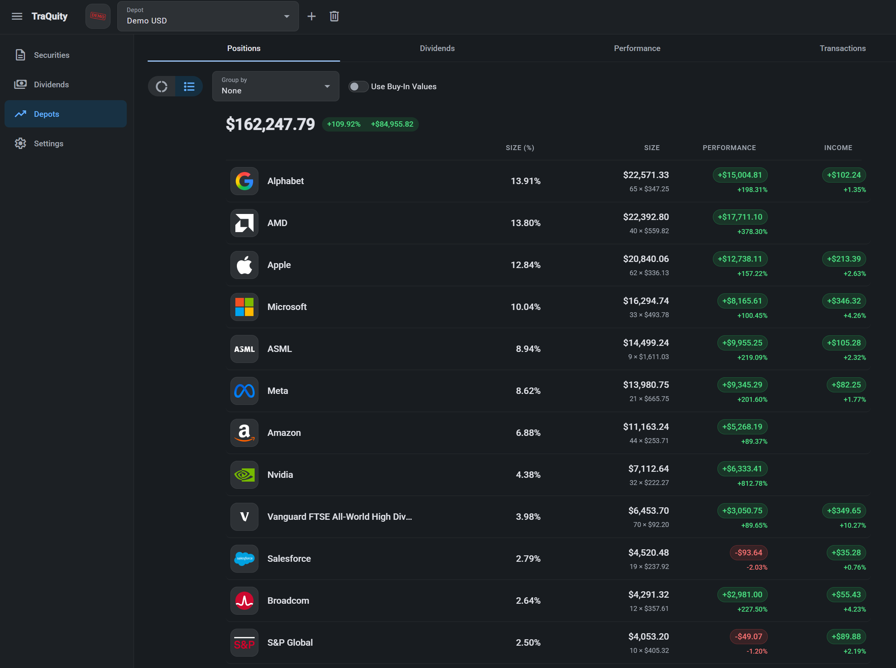

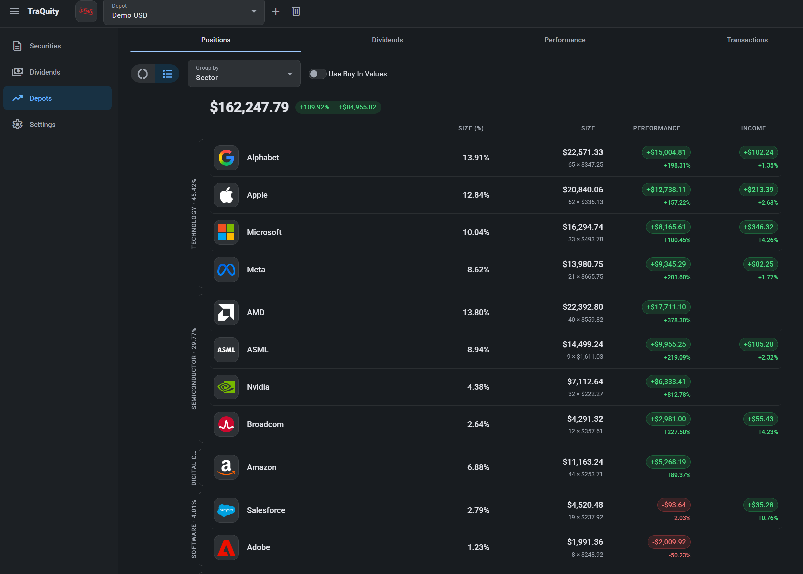

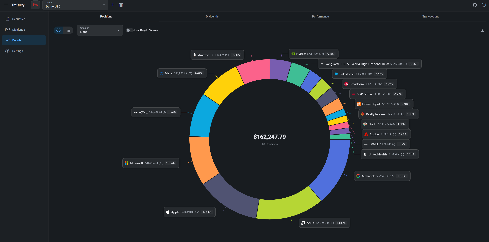

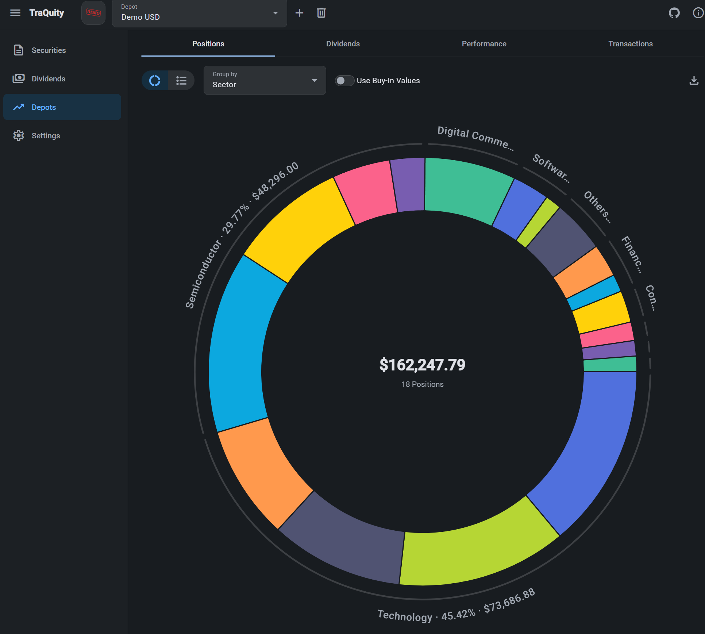

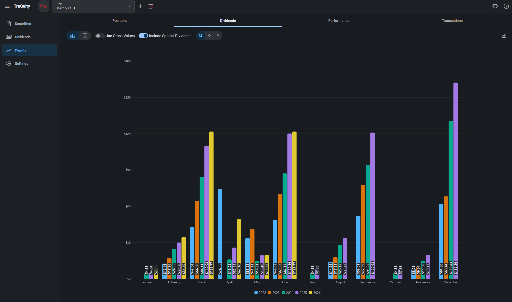

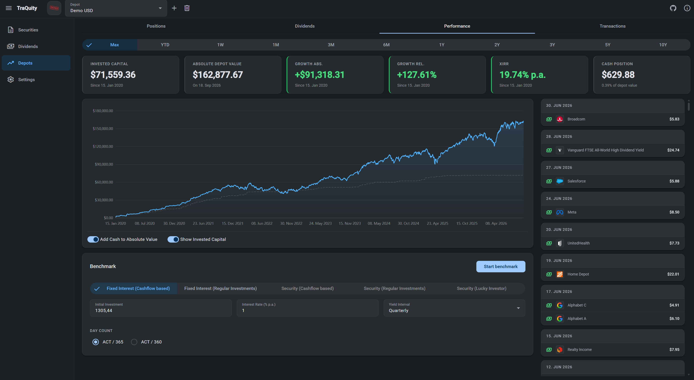

## Recording transactions

### Transaction types

| Type                 | Meaning                                                              |
|----------------------|----------------------------------------------------------------------|
| **Buy**              | Shares bought; increases the position and the invested capital       |
| **Sell**             | Shares sold; the proceeds stay in the depot as cash                  |
| **Dividend**         | A dividend received for a holding, also increasing the cash position |
| **Special Dividend** | A dividend marked as non-recurring/extraordinary                     |
| **Tax**              | A tax payment, e.g. a German "Vorabpauschale"                        |

There is no withdrawal type. See [There are no withdrawals](#there-are-no-withdrawals) for what that means for the numbers.

### Adding a transaction by hand

1. Select exactly one depot and open the **Transactions** tab.
2. Press **Add Transaction**.
3. Fill the form and press **Create**.

| Field                         | Required | Notes                                                                              |
|-------------------------------|----------|------------------------------------------------------------------------------------|
| **Transaction Type**          | yes      | Choosing `Dividend` reveals a **Special Dividend** checkbox                        |
| **Security**                  | yes      | Autocomplete; pick one of the offered securities, typing alone does not select one |
| **Date**                      | yes      | Date picker, formatted as configured under **Settings → Appearance**               |
| **Time**                      | no       | Only shown for `Buy` and `Sell`                                                    |
| **Quantity (original)**       | yes      | The number of shares as printed on the broker's document                           |
| **Quantity (split-adjusted)** | no       | The quantity in today's shares; leave empty when no split applies                  |
| **Gross Value**               | yes      | The amount before tax and fee, in the depot's currency                             |
| **Tax**                       | no       | Withholding or capital gains tax booked with this transaction                      |
| **Fee**                       | no       | Broker fee booked with this transaction                                            |

**Create** stays disabled until every required field is filled and every filled field is valid. A security that does not exist yet has to be
created first — see [Managing securities](#managing-securities).

### How the net value is computed

The dialog shows the resulting net value while you type:

- `Buy` and `Tax`: **net = gross + tax + fee**. Both add to what the transaction costs you.
- `Sell`, `Dividend` and `Special Dividend`: **net = gross − tax − fee**. Both reduce what arrives in the depot.

### Filling the form from a PDF

If an AI model is active (see [AI features](#ai-features)), the **Add Transaction** dialog carries an **Import PDF** button, and you can
also drop a PDF anywhere on the dialog. The model then reads one transaction out of that document and fills the form with it.

1. Press **Import PDF** and pick the broker's PDF, or drop the file on the dialog.
2. Wait for the progress bar. This takes seconds to minutes, depending on the model and your hardware.
3. Check every filled field against the document, correct what is wrong, and press **Create**.

Hints:

- Nothing is created until you press Create.
- The PDF needs a text layer.
- The security is matched by ISIN, so documents that don't provide exactly one ISIN are not compatible with this feature.

### Importing transactions from a CSV file

Press **Import Transactions** on the **Transactions** tab. The import is a four-step wizard, and nothing is written before step 4.

**Step 1 — File.** Press **Select File** and pick the CSV exported from your broker. The wizard shows the file name, the number of parsed
rows, and an error if it could not detect a column separator. The first row is read as the header.

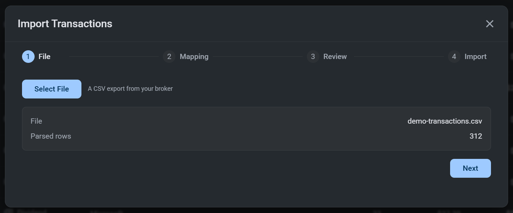

**Step 2 — Mapping.** Everything about interpreting the file is set here:

- **Separator** — `Semicolon (;)`, `Comma (,)`, `Tab` or `Pipe (|)`. Detected automatically, changeable here.
- **Column Mapping** — one dropdown per transaction field, listing the columns of your file. Required fields are marked with `*`:

  | Field            | Required | Note                                                |
    |------------------|----------|-----------------------------------------------------|
  | Date             | yes      |                                                     |
  | Time             | no       |                                                     |
  | Transaction Type | yes      | Its values are mapped below                         |
  | ISIN             | no       | At least one of ISIN, Name or Symbol must be mapped |
  | Name             | no       | At least one of ISIN, Name or Symbol must be mapped |
  | Symbol           | no       | At least one of ISIN, Name or Symbol must be mapped |
  | WKN              | no       |                                                     |
  | Quantity         | yes      |                                                     |
  | Gross Value      | yes      |                                                     |
  | Tax              | no       |                                                     |
  | Fee              | no       |                                                     |

- **Transaction Type Mapping** — once the type column is mapped, the wizard lists every distinct value found in it (`Kauf`, `BUY`,
  `Dividende`, …). Map each one to a TraQuity type, or to **Skip these rows** for the ones you do not want to import.
- **Date Format** — one of `yyyy-MM-dd`, `dd.MM.yyyy`, `dd/MM/yyyy`, `MM/dd/yyyy`, `d.M.yyyy`, `yyyy/MM/dd`.
- **Decimal Separator** — comma or dot, for the amount and quantity columns.

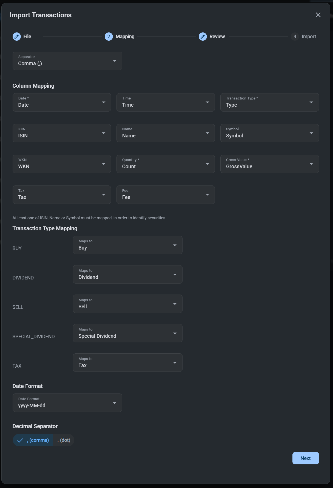

**Step 3 — Review.** A summary of what the import would do:

- **New Securities** — securities referenced by the file that the database does not know yet. They are created during the import, from the
  ISIN, name and symbol columns you mapped. Map as many of those three as your file has, so that matching against existing securities works
  and the created ones carry usable master data.
- **Transactions** — the count per transaction type, and the date range covered.
- **Skipped Rows** — rows that will not be imported, grouped by reason (an unmapped type value, an unparsable date, …).

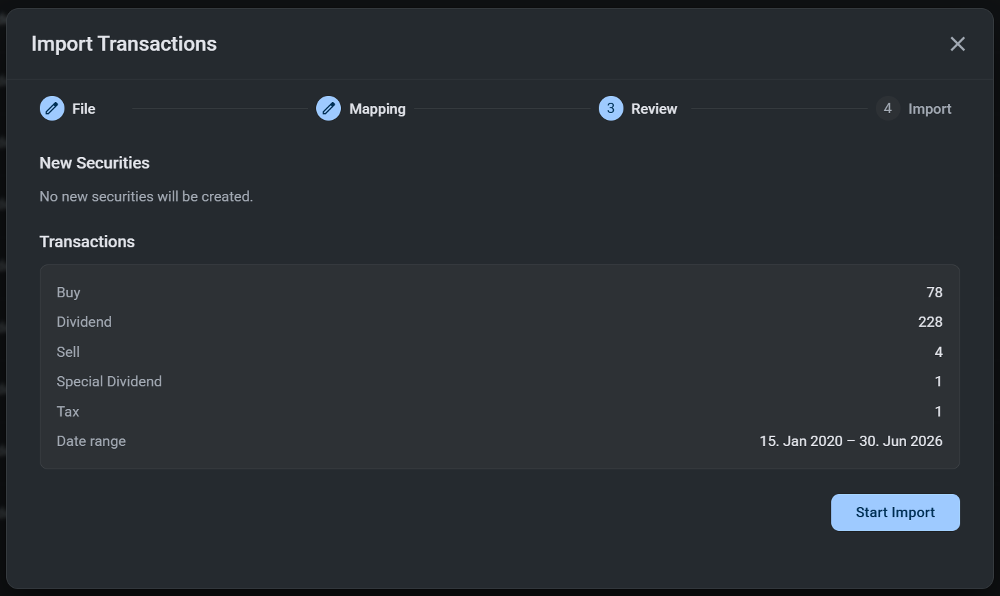

Press **Start Import** to run it.

**Step 4 — Import.** A progress bar runs while the rows are sent. When it finishes, the step reports how many securities and how many
transactions were created out of how many attempted. If any row failed, a **Download Failed Rows** button appears, which saves exactly those
rows as a CSV — fix them there and import that file again. Press **Close** to return to the transaction list.

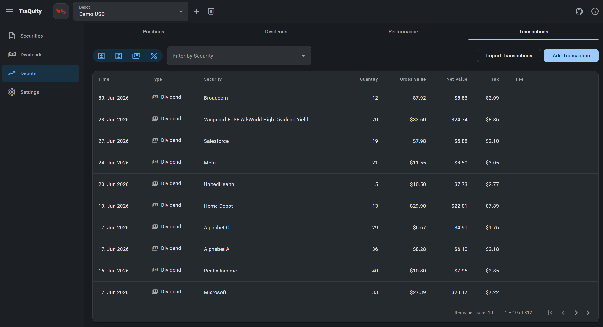

### Filtering, editing and deleting

The transaction table has a type filter (the icon toggles above the table) and a **Filter by Security** multi-select. Each row carries an
edit and a delete button; editing is done in place in the row.

## Managing securities

A security is a tradable instrument — a stock, an ETF, and so on. It holds master data, an optional historical price configuration, an
optional dividend announcement configuration, and stock splits. Transactions reference securities, so a security has to exist before a
transaction can name it, and the CSV import creates the missing ones for you.

### Adding a security

On the **Securities** page, press **Add**. The wizard has four steps, and each step's **Next** stays disabled until that step is valid.

**Step 1 — Master Data**

| Field    | Required | Notes                                                                                |
|----------|----------|--------------------------------------------------------------------------------------|
| Logo     | no       | A PNG, selected with **Select Logo**; click the preview to replace it                |
| **Name** | yes      | Shown everywhere the security appears, and what a transaction's autocomplete matches |
| **ISIN** | yes      | Also drives the country flag shown in the securities list                            |
| Symbols  | no       | Ticker symbols; type one and press Enter to add it as a chip, several are allowed    |
| WKN      | no       | German securities identification number                                              |
| Sector   | no       | Free text; this is what *Group by sector* on the Positions tab groups by             |
| Type     | yes      | `Stock`, `ETF`, …                                                                    |

**Step 2 — Historical Prices.** Which data source delivers this security's prices, and how it is identified there:

- **Enabled / Disabled** — whether prices are fetched at all. A configuration can be prepared and left disabled.
- **Data Source** — one of the sources under **Settings → Historical Security Prices**.
- **External Security ID** — the identifier the data source expects, e.g. `MSFT` for Twelve Data or `MSFT.US` for EODHD. This is what the
  `#id()` template function in the source's URL is replaced with.

The step is skippable: a security without a price configuration simply has no price chart and no current value.

**Step 3 — Dividend Announcements.** The same three settings for upcoming dividend announcements: **Data Source**, **External Security ID**
and an **Active** checkbox. Also optional.

**Step 4 — Summary.** A recap of the three steps. Press **Complete** to create the security.

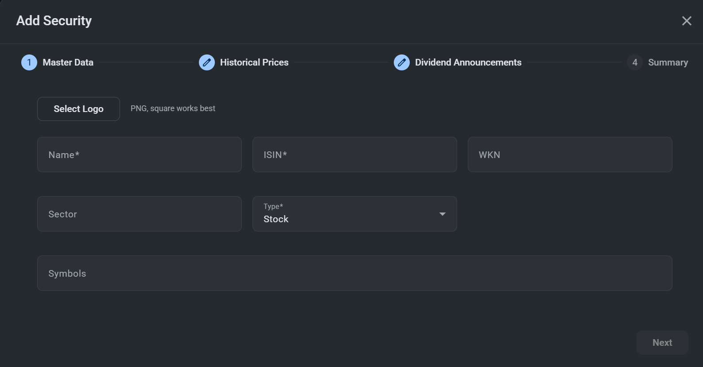

If a step reports *No Data Sources available*, no data source of that kind exists yet — see [Market data sources](#market-data-sources).

### Editing a security

HOver a security in the list and click the pen on the right to open **Edit Security**. It carries the same three sections as tabs, plus
**Stock Splits**. A dot on a tab label marks unsaved changes there, a warning triangle marks invalid ones.

- **OK** saves and closes.
- **Apply** saves and keeps the dialog open.
- **Cancel** discards everything unsaved.

This is also where a prepared-but-disabled price configuration is switched on, for example for the Microsoft and Apple examples in a fresh
database, once your API key is set.

### Stock splits

Open **Edit Security → Stock Splits**. The tab lists the recorded splits with ex-date, ratio and resulting multiplier, and a row to add one:

1. Pick the **Date** (the ex-date).
2. Enter **Quantity old** and **Quantity new** — a 4-for-1 split is `1` old, `4` new. The resulting multiplier is shown next to the fields.
3. Leave **Update transactions and historical prices** ticked to have existing transactions and stored prices before that date adjusted by
   the multiplier. Untick it if your broker's data is already split-adjusted.
4. Press the save button.

Note that once a stock split for a date is saved, no more stock splits can be saved for that day or any days before. So if you have
multiple stock splits to configure for one stock, do so in chronological order.

### Security groups

Under **Settings → Security Groups**, several securities can be grouped under one name — the ADR and the ordinary share of one company, or
the share classes of a dual-class listing. Press **Add new Security Group**, enter a **Name**, add securities under **Members**, and press
**Save**. Grouped securities are displayed under the group's name. The logo is chosen from one of the securities contained therin, so for
best experience ensure all securities belonging to the same group have the same logo configured.

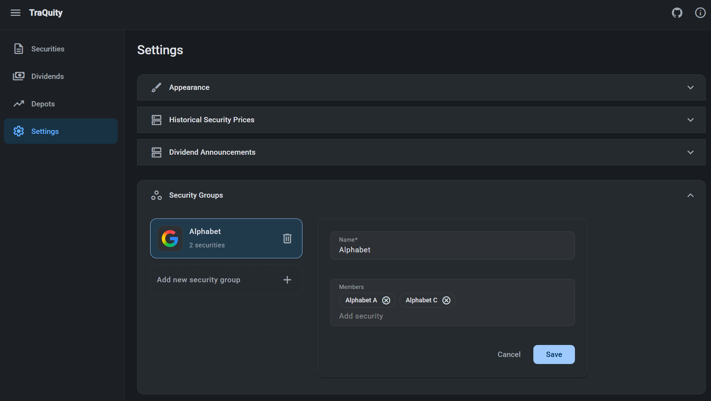

### The securities list

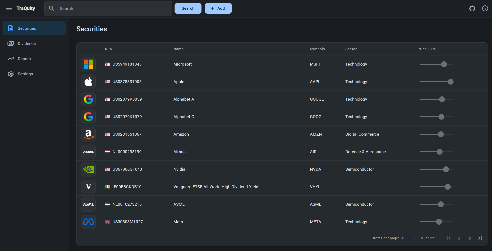

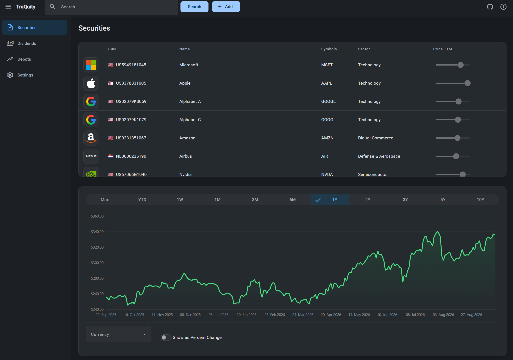

The list carries a search field and shows, per security, its logo, ISIN with country flag, name, symbols, sector and the last known price.
The last known price is shown in a slider, where the left end represents the 52-week low and the right end the 52-week high. This helps you
to quickly get an idea where the price is at, without having to open the chart.

Clicking a row opens the security's detail view with the historical price chart.

## Market data sources

A **data source** describes one HTTP/JSON API: which URL to call, which JSON paths to read, how to interpret dates and currencies. A
**configuration** on a security then binds that source to one security via an external ID. There are two kinds of source, and they are
managed separately:

- **Settings → Historical Security Prices** — daily prices per security.
- **Settings → Dividend Announcements** — upcoming dividends per security.

TraQuity ships with preconfigured price sources, requiring a personal API key. TraQuity is not affiliated with any provider, and your use of
their APIs is subject to their terms and plan limits. The same applies to any source you add yourself.

### Entering an API key for a preconfigured source

1. Open **Settings → Historical Security Prices**.
2. Select the datasource in the list on the left.
3. Enter your key in the **API Key** field and press **Save**.

These two sources show only the API key form, because everything else about them is already set. The preconfigured sources may also not be
deleted. Deleting them by hand from the database is strongly discouraged, as future updates of the TraQuity app may reference their database
IDs and therefore, your database may be incompatible with future updates of the app.

### Adding, replacing and deleting a data source

Every other data source is defined by a JSON file:

1. Open **Settings → Historical Security Prices** or **Settings → Dividend Announcements**.
2. Press **Add new Data Source** in the list on the left, or select an existing source to replace its definition.
3. Press **Select Configuration File** and pick your JSON file.
4. Press **Save**.

**Save** stays disabled until a valid file has been selected. A file is rejected when it is not valid JSON, when a required field is
missing, when a value has the wrong type, or when it carries a key that does not belong to this kind of data source. The two exceptions are
`id` and `version`: a file exported from an existing source may carry them, and they are ignored.

To delete a source, press the bin button on its card and confirm. A security still pointing at a deleted source loses its price or
announcement updates.

### The file format

Both kinds share most of their fields. Every field below is required unless marked optional.

| Field                | Type              | Meaning                                                                                   |
|----------------------|-------------------|-------------------------------------------------------------------------------------------|
| `name`               | string, 1–255     | The name shown in the settings list                                                       |
| `urlPatterns`        | array, ≥ 1 entry  | **Prices only.** One entry per time span, see below                                       |
| `urlPattern`         | string            | **Announcements only.** The single URL to call                                            |
| `requestHeaders`     | array             | `{"headerName": "...", "headerValue": "..."}` pairs; may be empty                         |
| `jsonPathDate`       | string            | JSON path to the dates in the response                                                    |
| `jsonPathValue`      | string            | JSON path to the prices, or to the dividend amounts per share                             |
| `dateFormat`         | object            | `{"format": "..."}`, see below                                                            |
| `jsonPathCurrency`   | string, optional  | JSON path to the currency; when absent, the external security ID is used as the raw value |
| `regexCurrency`      | string, optional  | Regular expression applied to that raw currency value                                     |
| `regexCurrencyGroup` | integer ≥ 0, opt. | Which capture group of `regexCurrency` to take; defaults to the whole match               |
| `currencyMappings`   | array             | Rewrites of the extracted currency, see below; may be empty                               |
| `marketCloseTimes`   | array, optional   | **Prices only.** When today's price may be stored, see below                              |

`dateFormat` takes one of three shapes:

```json
{
  "format": "TIMESTAMP_SECONDS"
}
{
  "format": "TIMESTAMP_MILLISECONDS"
}
{
  "format": "CUSTOM_STRING",
  "customPattern": "yyyy-MM-dd"
}
```

`customPattern` is a Java `DateTimeFormatter` pattern and is what `CUSTOM_STRING` needs; the two timestamp formats take the number as it
comes.

A `currencyMappings` entry rewrites what the response reports:

```json
{
  "currencyKey": "GBp",
  "mappedCurrencyCode": "GBP",
  "multiplier": 0.01
}
```

`mappedCurrencyCode` is a three-letter uppercase code. `multiplier` is optional and multiplies the value — the example turns pence into
pounds. This is also how an exchange suffix becomes a currency: EODHD reports no currency at all, so its source extracts `US` from the
external ID `MSFT.US` with `regexCurrency` and maps `US` to `USD`.

A `marketCloseTimes` entry is a closing time in one time zone:

```json
{
  "time": "16:00:00",
  "timeZone": "America/New_York"
}
```

The app will only persist a price for today's date if all `marketCloseTimes` of the data source have passed. It is highly recommended to put
above example into every historical security price data source. Along with the market close time of other exchanges that are important to
you.

### Creating a historical security price data source

`urlPatterns` is the one part with real logic behind it. Each entry pairs a URL with the number of days that URL covers:

```json
{
  "timespanInDays": 30,
  "urlPattern": "https://example.com/prices/#id()?days=30&key=#mask(YOUR_KEY)"
}
```

TraQuity picks among them by how much history it is missing for that security:

- **No prices stored yet:** every URL is called, from the shortest time span to the longest, and the results are merged. The longest one is
  what backfills the history.
- **Prices already stored:** the URLs are called in ascending order of `timespanInDays` until one covers the gap since the newest stored
  price, then it stops. A daily start therefore only ever calls the smallest URL — which is what keeps a free plan's request budget intact.

So provide several spans (a week, a month, a year, everything) when the API supports it, and a single large one otherwise. There is no
special timespan for 'maximum' or 'everything', so rather pick a very high number for that. Take note, that you are not able to fetch market
data older than the longest timespan defined by the data source.

A complete example:

```json
{
  "name": "Example Prices",
  "urlPatterns": [
    {
      "timespanInDays": 30,
      "urlPattern": "https://example.com/prices/v1/#id()?range=30d&key=#mask(YOUR_KEY)"
    },
    {
      "timespanInDays": 365,
      "urlPattern": "https://example.com/prices/v1/#id()?range=1y&key=#mask(YOUR_KEY)"
    }
  ],
  "requestHeaders": [
    {
      "headerName": "Accept",
      "headerValue": "application/json"
    }
  ],
  "jsonPathDate": "$.prices[*].date",
  "jsonPathValue": "$.prices[*].price",
  "jsonPathCurrency": "$.currency",
  "dateFormat": {
    "format": "CUSTOM_STRING",
    "customPattern": "yyyy-MM-dd"
  },
  "currencyMappings": [
    {
      "currencyKey": "GBp",
      "mappedCurrencyCode": "GBP",
      "multiplier": 0.01
    }
  ],
  "marketCloseTimes": [
    {
      "time": "16:00:00",
      "timeZone": "America/New_York"
    },
    {
      "time": "22:00:00",
      "timeZone": "Europe/Berlin"
    }
  ]
}
```

How the response is read:

- `jsonPathDate` and `jsonPathValue` must select **lists of equal length** — one date per price. A response where the two differ in length
  is discarded entirely, with the reason in `traquity.log`.
- `jsonPathCurrency` may select either a list of the same length or a single value, which then applies to every row.
- Rows whose date, value or currency is `null` are skipped.
- Only dates **before today** are stored, unless `marketCloseTimes` is given: then today's price is stored once every listed closing time
  has passed. Dates in the future are never stored.
- A price that is not newer than the newest stored one is ignored, so re-fetching never overwrites history.

### Creating a dividend announcement data source

The announcement file is the same minus `urlPatterns` and `marketCloseTimes`, plus a single `urlPattern`:

```json
{
  "name": "Example Dividends",
  "urlPattern": "https://example.com/dividends/#id()?from=#date(yyyy-MM-dd,0)&token=#mask(YOUR_KEY)",
  "requestHeaders": [
    {
      "headerName": "Accept",
      "headerValue": "application/json"
    }
  ],
  "jsonPathDate": "$.dividends[*].payDate",
  "jsonPathValue": "$.dividends[*].amount",
  "jsonPathCurrency": "$.dividends[*].currency",
  "dateFormat": {
    "format": "CUSTOM_STRING",
    "customPattern": "yyyy-MM-dd"
  },
  "currencyMappings": []
}
```

Here `jsonPathDate` selects the **pay date** and `jsonPathValue` the **amount per share**. The same equal-length rule applies. Announcements
whose pay date lies before today are discarded, and one already stored for the same security, date and amount is not stored twice.

### Template functions

URL patterns and header values are templates. A function is written `#name(arguments)` and is replaced before the request is sent.

| Function                  | Replaced with                                                       |
|---------------------------|---------------------------------------------------------------------|
| `#id()`                   | The security's **External Security ID** for this data source        |
| `#date()`                 | Today as `yyyy-MM-dd`                                               |
| `#date(pattern)`          | Today, formatted with a Java date pattern, e.g. `#date(dd.MM.yyyy)` |
| `#date(pattern,daysBack)` | The same, moved back by that many days, e.g. `#date(yyyy-MM-dd,30)` |
| `#mask(secret)`           | The argument itself — and the value is masked in the log output     |
| `#uuid()`                 | A fresh random UUID                                                 |
| `#rng(min,max)`           | A random integer between `min` and `max`, both inclusive            |
| `#base64(text)`           | The argument, base64-encoded                                        |

Put an API key into `#mask(...)` rather than writing it plainly: it is what keeps the key out of `traquity.log`, and for the two
preconfigured sources it is also the place the **API Key** field writes to.

## AI features

TraQuity can run a language model on your own computer. It is switched off until you turn it on, and it currently serves exactly one
feature: [filling the transaction form from a PDF](#filling-the-form-from-a-pdf). A model is downloaded once; running it afterwards makes
no network request at all. Everything below lives under **Settings → AI**.

### Turning it on

The section starts with a notice: the model weights come from third parties, the download is large in size, answers can be wrong, and none
of this is financial advice. Press **Confirm** to get past it. Confirming downloads nothing — it only opens the section.

### Choosing a model

The section lists the models TraQuity offers, each with its size, its license and a status:

| Status          | Meaning                                            |
|-----------------|----------------------------------------------------|
| **Active**      | This is the model the app uses                     |
| **On disk**     | Downloaded, but another model is active or none is |
| **Not on disk** | Not downloaded                                     |

Next to it, TraQuity states what it makes of that model on this machine. It probes the GPU once per start:

| Label                       | Meaning                                                                     |
|-----------------------------|-----------------------------------------------------------------------------|
| no label                    | Your GPU has enough free memory for this model                              |
| **Needs X, Y available**    | The GPU was found, but has less free memory than recommended for this model |
| **No supported GPU**        | No GPU TraQuity can use was found                                           |
| **GPU backend unsupported** | A GPU was found, but not one that is recommended                            |
| **Not probed**              | The probe itself failed; a warning at the top of the section says so too    |

A label is a recommendation, not a lock: any listed model can be downloaded and activated. A model that fits into the GPU answers in
seconds; one that does not runs partly or fully on the CPU, which works but can take minutes to produce a result. In this case, it may
feel like the application hangs.

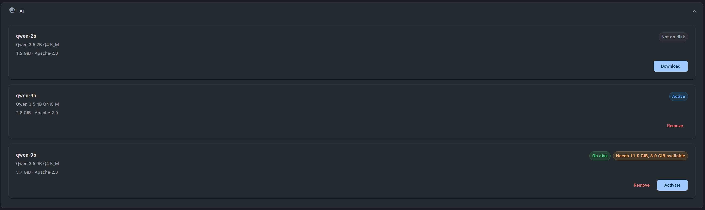

### Downloading, activating and removing

**Download** asks for a folder to put the model file in and then runs in the background — the progress, speed and remaining time appear in
the app header, so you can keep using the app while it downloads. TraQuity checks that the folder's disk has room before it starts Only one
download runs at a time.

**Activate** makes a downloaded model the one the app uses. At most one model is active at any given time, so activating one deactivates any
other.

**Remove** asks for confirmation and then deletes the model file from disk.

### Adjusting the PDF import prompt

The instructions the model gets for the PDF import are a file that ships with the app, and you can override them when the results on your
own broker's documents are poor. The packaged file is `prompts/transaction-extraction/default.md` in the app's `resources` directory
(`TraQuity.app/Contents/Resources/` on macOS); copy it to `ai/prompts/transaction-extraction/default.md` inside the `traquity` folder in
your home directory and edit that copy. TraQuity prefers your copy over the packaged one on every import, so nothing has to be rebuilt and
deleting the copy restores the shipped instructions. `traquity.log` records which file was used for each import, which is the quickest way
to tell whether your copy is in effect.

Hint: At the cost of providing your documents to an online LLM, you can have a stronger LLM figure out a good prompt for your broker's PDF
files.

## A tour of the screens

### Dividends

Upcoming dividend announcements, grouped by week. New announcements also appear under the notification bell in the header.

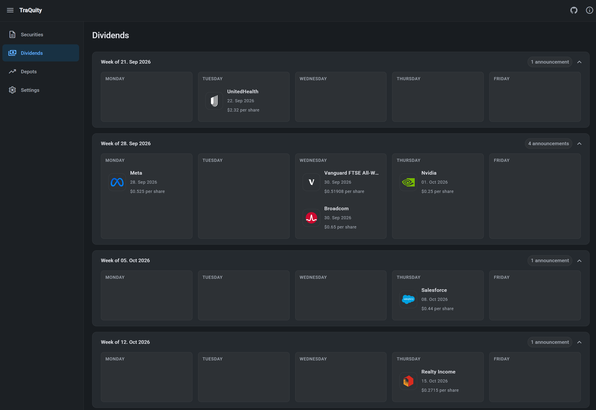

### Settings

- **Appearance** — date, currency and number formats. **Hide Absolute Values** masks currency amounts app-wide, which is useful when
  sharing a screen. **Enable Dev Mode** unlocks direct database access, see
  [Dev mode and direct database access](#dev-mode-and-direct-database-access).
- **Historical Security Prices** / **Dividend Announcements** — manage your data sources and their API keys.
- **Security Groups** — organize securities into named groups.
- **Database** — **Restart & configure database…** restarts the app into the configuration screen, where the database file and the Java
  runtime can be changed.
- **AI** — download, activate and remove the local model used by the PDF import. See[AI features](#ai-features).

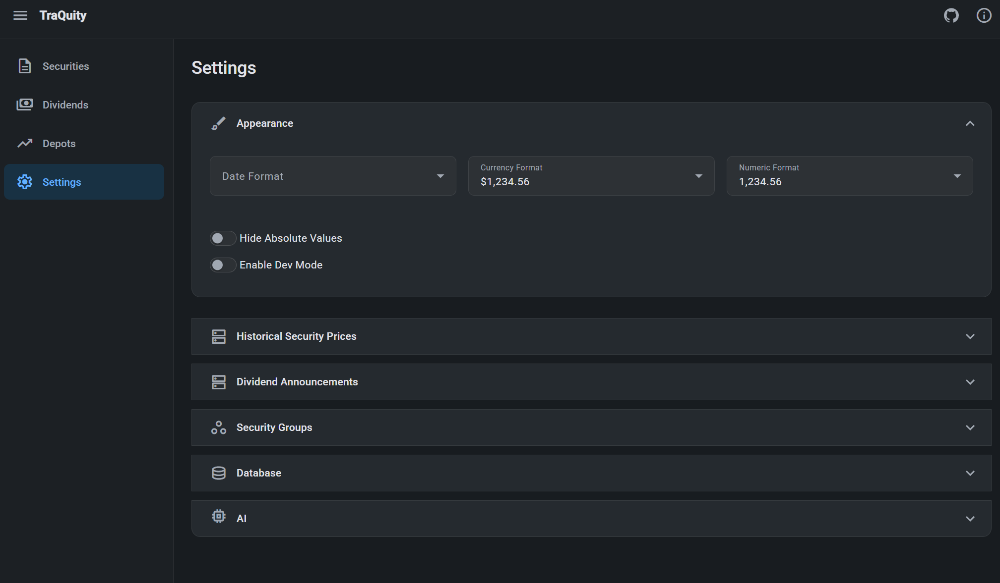

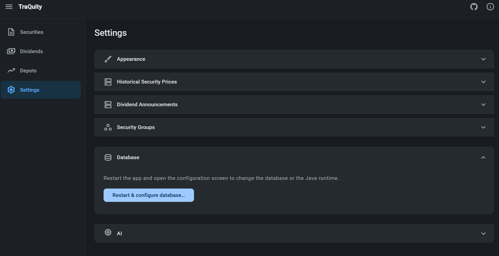

### The header

Besides the page controls, the header holds the notification bell for new dividend announcements, an indicator that appears when a newer
TraQuity release exists on GitHub, a link to the GitHub repository, an **About** dialog with version and third-party license information on
its `About` tab and the [transparency note](#privacy-what-leaves-your-computer) on its `Transparency` tab, and — while dev mode is active —
the database button. A running
[AI model download](#ai-features) shows its progress here too.

## Understanding your depot performance numbers

TraQuity shows several numbers that all describe "performance" from different angles. This section explains what each one means, so the
figures do not look contradictory.

### There are no withdrawals

TraQuity does not model money leaving your depot. When you sell a position or receive a dividend, the proceeds become **cash held inside
the depot**, available to fund your next buy, or sitting there earning nothing until you reinvest it. If a tax payment (for example a German
"Vorabpauschale") exceeds the available cash, the shortfall is treated as freshly invested capital, exactly like a deposit.

One consequence is worth knowing: **"Invested Capital" only ever grows.** It represents everything you have ever put into the depot, in
stock or in cash. It does not shrink when you sell something, because selling does not take money out of the depot.

### Growth (abs. / rel.)

The KPI tiles and the chart tooltip on the Depot Performance page show the depot's raw value change over the selected period: how much the
total depot — stocks **and** cash — moved, in currency and in percent. It is not corrected for money deposited during that period, so fresh
capital shows up as growth too. The **Add Cash to Absolute Value** checkbox switches between including and excluding idle cash. **Show
Invested Capital** compares the depot's total value against the total amount ever put in.

### XIRR

XIRR (Extended Internal Rate of Return) is the depot's **annualized money-weighted return**. It treats every deposit as money leaving your
pocket and the current total depot value (stocks + cash) as what you would get back if you liquidated everything today, then solves for the
constant yearly rate that makes those numbers consistent. Larger and longer-held contributions weigh more heavily than small, recent ones.

### Fixed Interest Benchmark

This compares the depot against a fixed-interest alternative. There are two variants:

- **Cashflow-based** — "what if I had put the same money into a fixed-interest account instead?"
- **Regular Investments** — a monthly savings plan, either with a fixed monthly contribution or reinvesting whatever you actually invested
  into the depot that month. You can configure the day of deposit; a day falling on a weekend is carried out on the next Monday.

One thing to watch: the interest rate you enter is a **nominal rate**, compounded at whichever interval you choose (quarterly by default).
XIRR is an effective annual rate. A nominal 16.5% compounded quarterly works out to roughly 17.5% effective annual, so the benchmark rate
that visually matches your depot curve can differ from your XIRR by about a percentage point. Neither number is wrong; they are different
conventions.

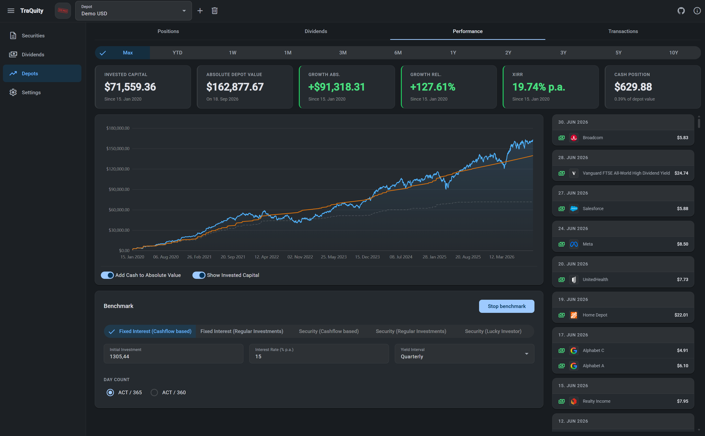

### Position-level returns

The Positions view is the exception: the return shown per holding is deliberately **cash-exclusive**. It is the gain or loss on that
specific position relative to what you paid for it, the same figure any broker or stock screener shows. Cash sitting elsewhere in the depot
has no bearing on how one particular stock performed.

For every position you currently hold, the view also shows net income, which is dividends and special dividends minus taxes.

Clicking a position drills down into each lot you currently hold, including a CAGR per lot.

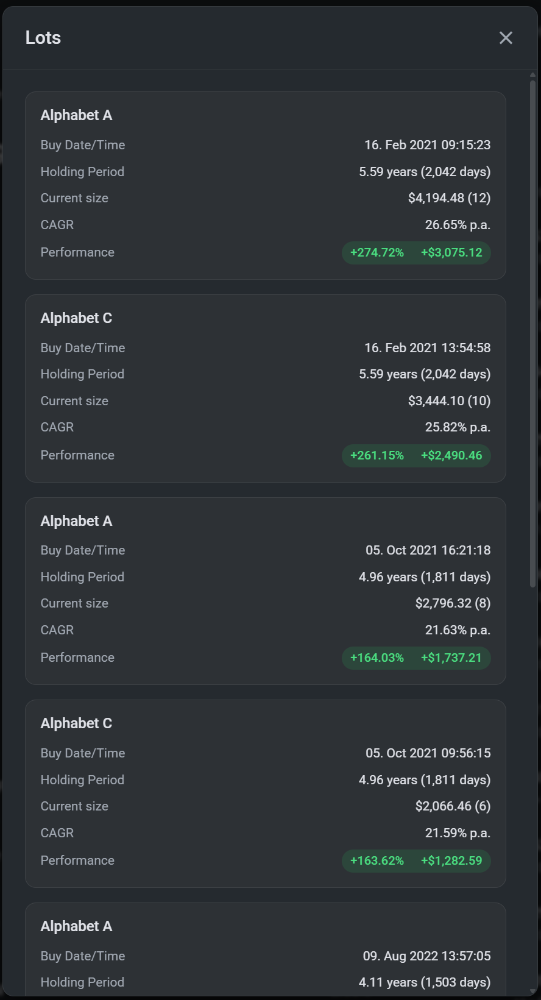

## Dev mode and direct database access

Enable **Dev Mode** under **Settings → Appearance** and a database button appears in the header. It opens a dialog with the embedded H2 web
console and the connection details — JDBC URL, user, password, file location. Copy or type these into the web console to gain access.

This is raw SQL access to your live data. Make a backup before changing anything, and treat the connection details as sensitive: they
include the database password in plain text.

Accessing your raw data through the app is one of the ways this app grants you full sovereignty about YOUR data. Keep in mind that changes
you apply here may break the database. Some errors may be visible immediately, some might be visible later or with the next app update.

## Troubleshooting

**The unlock screen says *wrong password or corrupted database***
The backend could not open the file with the password you typed. Try again, and check `traquity.log` for the underlying error.

**`OK` on the unlock screen stays disabled**
The app remembers a password for this database and your input does not match it. If the file's password was changed outside the app. Choose
**Use a different database…**, then press **Re-verify the password on next start** in the configuration screen.

**The app opens the configuration screen with a warning notice**
A start failed for a database whose password was remembered, or Java could not be resolved. The notice names the file; `traquity.log` names
the cause.

**The app opens the configuration screen on every start**
`traquity.config.json` cannot be read, or it names no database. Repair or delete the file, or select a database and press **Save & start**.

**The screen says *TLS verification is disabled**
`NODE_TLS_REJECT_UNAUTHORIZED` is set to something other than `1`. Unset it, or set it to `1`, and start the app again.

**The app starts into an empty portfolio**
The configured path points at a file that does not exist, so a new, empty database was created there. Quit, delete that new file, and select
the real database file with **Use existing…** in the configuration screen. See [Moving the database](#moving-the-database).

**The splash screen never goes away**
The backend did not become reachable. Check `traquity.log`, and check that nothing else occupies ports `23726` or `29232`.

**A data source file cannot be saved**
The file is not valid JSON, misses a required field, or carries a key the app does not know. Compare it against
[The file format](#the-file-format).

**Prices or dividend announcements do not update**
Check the API key under **Settings**, the provider's plan limits, and whether the security's price configuration is enabled in its detail
view.

**The Add Transaction dialog says *AI is switched off — enable it in Settings***
No model is active. Download one and press **Activate** under **Settings → AI**, see [AI features](#ai-features).

**A PDF import fails or fills the form with wrong values**
The message names what went wrong; `traquity.log` carries the document text, the model's answer and the prompt file that was used. A
larger model usually reads a difficult document better, and the instructions themselves can be replaced — see
[Adjusting the PDF import prompt](#adjusting-the-pdf-import-prompt).

**Java verification fails in the configuration screen**
The configured path does not point at a runnable `java`. Pick another one with **Custom path…**, switch to **Automatic**, or use **Download
Corretto**.

`traquity.log` sits next to `traquity.config.json` (see [The configuration file](#the-configuration-file)) and is rewritten on every start,
so reproduce a problem first and read the log afterwards.
